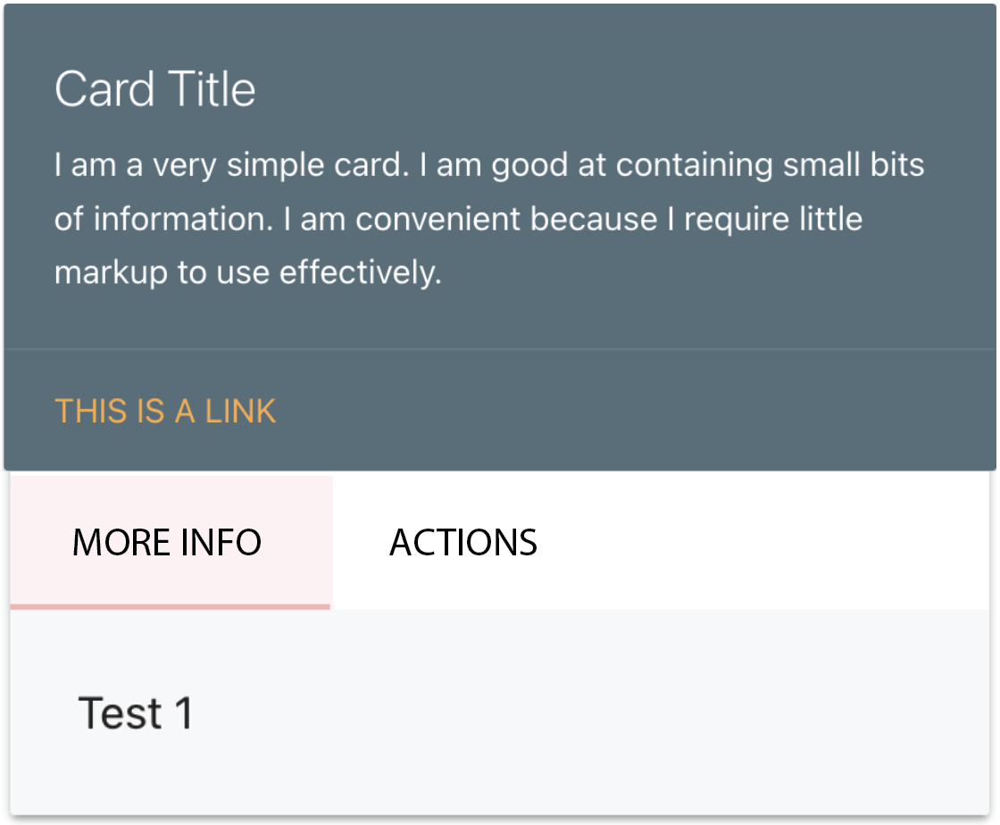

# Wishlist project

The purpose of this project is to create a wishlist for a user to populate with products, or experiences, they would like to purchase.

Am I responsive screenshot here.

## Table of Contents

1. [Wireframes](#wireframes)
2. [User stories](#user-stories)
3. [Data modeling](#data-modeling)
4. [Design](#design)
5. [Debugging](#debugging)
6. [Technologies](#technologies)
7. [Credit](#credit)

## Wireframes

## User stories

1. Easy way to create categories of items

2. Adding items to wishlist

3. 

## Data modeling

The wishlist items will each have certain input fields, ranging from basic integer fields like id to boolean fields which identify whether the item is considered luxury by the user.

These data fields allow a user to have an overview of each wishlist item, and relate back to the categories when required.

## Design

Utilising Materialize cards, design one which allows the user to see information about the wishlist item at a glance and switch between more info and editing/deleting.

Navbar - link on right as that feels natural to me

## Debugging

### Cards

Materialize handily provided a code to initialise these cards via JavaScript (which I didn't think I'd need again!) if you read the initial paragraph more closely, and hidden behind another link, so I did this and it solved my issue.

### Card tabs

I wanted my cards to have tabs for the additional information and editing capability, in order to make the interface cleaner for the user. This however was hampered by these tabs not working. After resolving a similar issue on the cards initially, I went searching Stack Overflow and found that in fact, even though it is not documented, the tabs do need a JS script to initialise and I implemented this. [Stack Overflow source](https://stackoverflow.com/questions/40677831/materialize-css-tabs-are-not-working). After this, a singular card worked, but not all the others, so I had a look at the previous JS code to figure out how it applied to all and just added All onto the end of my querySelector.

## Technologies

### HTML5

HTML5 was used for basic structure of the site.

### CSS3

CSS3 was used minimally to fix issues with formatting in certain areas.

### Materialize

The Materialize framework was utilised to create the cards, buttons and general standard formatting of the site.

### Flask

Flask was used to kickstart the Python logic in this app and provide a starting point.

### Python

Python was used to create the database integration.

### Am I Responsive?

Am I Responsive? was used to create the screenshot for the finished project.

### Font Awesome

## Future development

Order by date and time created:
didn't have time to figure this out this time around

## Credit

Massive credit given to Tim at Code Institute and the walkthrough for the Relational Databases module. This wishlist is an amended version of his task manager and some standard bits of code (such as those in the app.py file) are borrowed directly from his work.

Secondly, a big thank you to my friend Ariela for once again sitting down with me and helping me through this project. I personally found the pivot from JavaScript to Python quite difficult, and she is actually a .NET developer so appreciated the learning opportunity. Together, we figured bugs out and learned a lot!

## Gitpod Reminders

### HTMl, CSS, JS

To run a frontend (HTML, CSS, Javascript only) application in Gitpod, in the terminal, type:

`python3 -m http.server`

A blue button should appear to click: _Make Public_,

Another blue button should appear to click: _Open Browser_.

### Python

To run a backend Python file, type `python3 app.py`, if your Python file is named `app.py` of course.

A blue button should appear to click: _Make Public_,

Another blue button should appear to click: _Open Browser_.

In Gitpod you have superuser security privileges by default. Therefore you do not need to use the `sudo` (superuser do) command in the bash terminal in any of the lessons.

### Heroku

To log into the Heroku toolbelt CLI:

1. Log in to your Heroku account and go to Account Settings in the menu under your avatar.
2. Scroll down to the API Key and click Reveal
3. Copy the key
4. In Gitpod, from the terminal, run `heroku_config`
5. Paste in your API key when asked

You can now use the `heroku` CLI program - try running `heroku apps` to confirm it works. This API key is unique and private to you so do not share it. If you accidentally make it public then you can create a new one with _Regenerate API Key_.

### Troubleshoot

THE THING:
set_pg

IF psql not working
