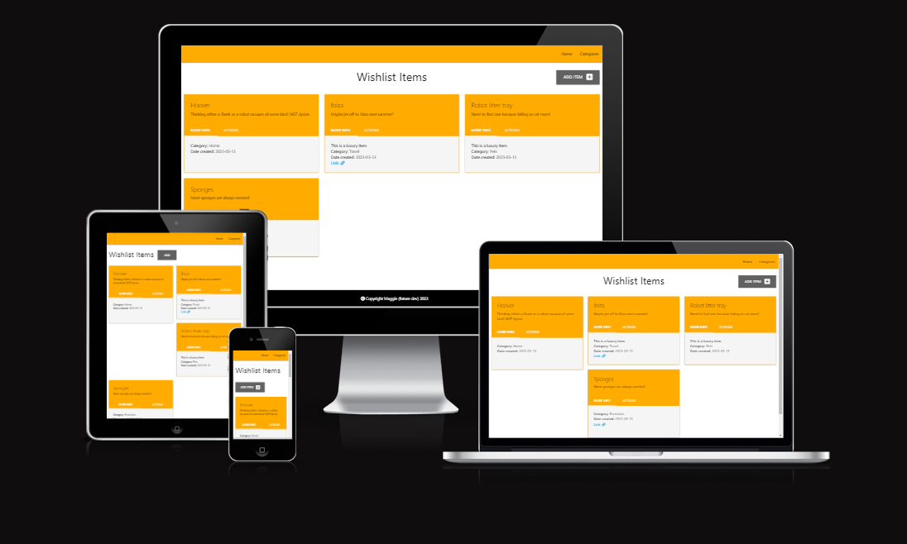
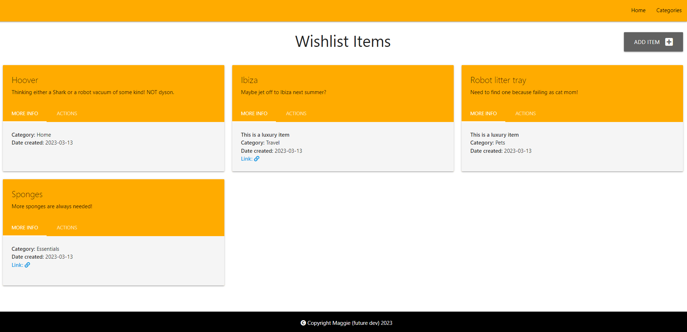
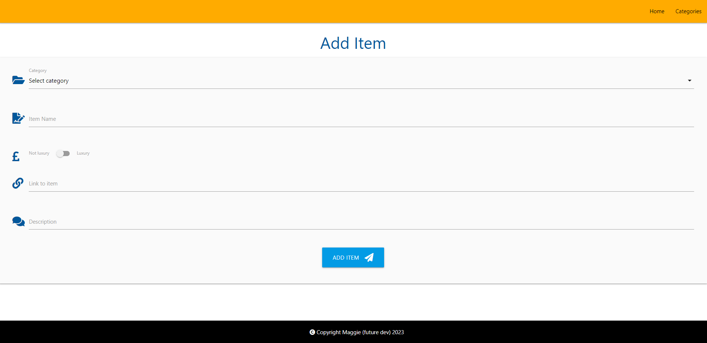
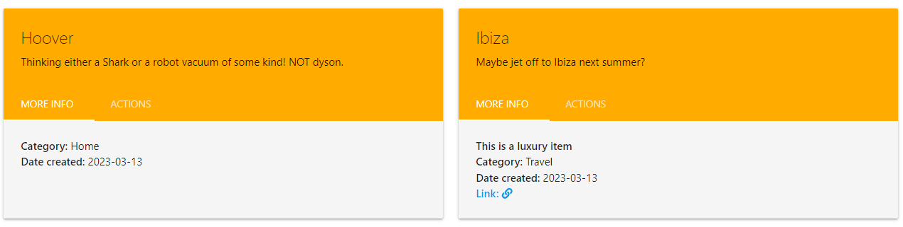
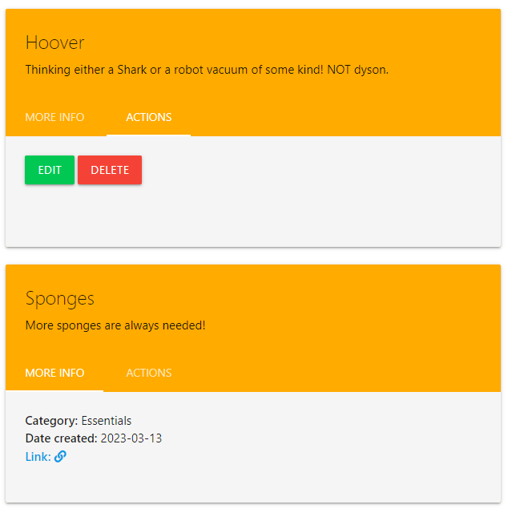
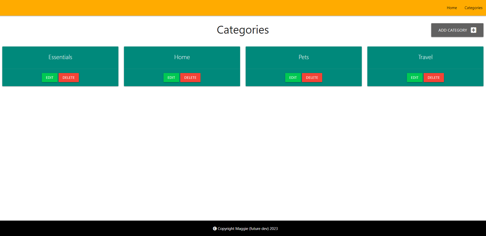
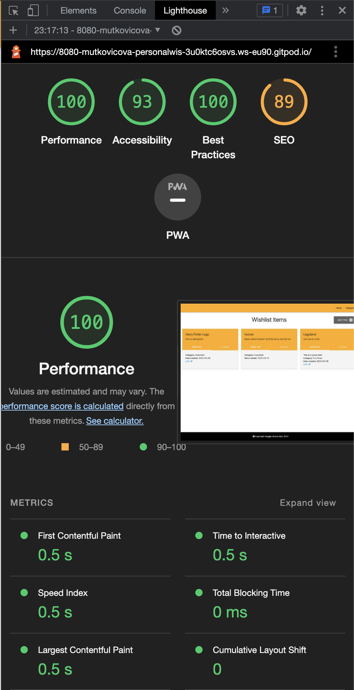

# Wishlist project

The purpose of this project is to create a wishlist for a user to populate with products, or experiences, they would like to purchase in the future.

## Table of Contents

1. [User features, purpose and value](#user-features-purpose-and-value)
2. [Data modeling](#data-modeling)
3. [Design](#design)
4. [Testing](#testing)
    1. [Lighthouse](#lighthouse)
    2. [Python validator](#python-validator)
    3. [W3 HTML validator](#w3-html-validator)
5. [Debugging](#debugging)
    1. [Cards](#cards)
    2. [Card tabs](#card-tabs)
    3. [Icons](#icons)
6. [Technologies used](#technologies-used)
    1. [HTML5](#html5)
    2. [CSS3](#css3)
    3. [Materialize 1.0.0](#materialize-100)
    4. [Flask](#flask)
    5. [Python](#python)
    6. [Am I Responsive?](#am-i-responsive)
    7. [Font Awesome 5.15.4](#font-awesome-5154)
7. [Future development](#future-development)
    1. [Order by date and time](#order-by-date-and-time-created)
    2. [Sort by](#sort-by)
    3. [Validation of action](#validation-of-action)
    4. [Login](#login)
    5. [Display all items within category](#display-all-items-within-category)
8. [Deployment](#deployment)
9. [Credit](#credit)

## User features, purpose and value

The value in this tool is that it can track wishlist items from as many categories as a user wishes! Rather than being a wishlist specifically for travel, or shopping, or anything of the kind, this interface allows a user to populate their list with sources from across the web.

The user is first presented with a full list of their items, sorted alphabetically by name. This means they have a clear overview of all their items, and can quicky add them when needed.

When adding items, a user can select from categories they have available, name their item, determine if they consider this a luxury item (this is left up to the interpretation of the user), a link to the item anywhere on the web and a quick description - in case they need a quick reminder of why they want this item.

Then, these items get displayed as simple card tabs. To enhance the interface, these cards have the name and description of the item displayed prominently, with further data such as if it is a luxury item, category, date created and a link to the item stored on a tab. This means the user doesn't have their view cluttered by an excess of data at first glance.

The tabs will also hide optional data, such as link, if this has not been filled in. A note denoting that this is a luxury item only appears if this has been selected.

To prevent accidental deletion of items (as this does not yet validate that decision to delete), action buttons are stored on a secondary tab. This means a user has to perform an extra action to delete or edit their item, rather than have it in plain view. Particularly in mobile view scenarios, this prevents some mishaps from occuring.

Finally, the category page has a simple overview of all the categories the user has created. This allows for quick adding of said categories.

## Data modeling

The wishlist items will each have certain input fields, ranging from basic integer fields like id to boolean fields which identify whether the item is considered luxury by the user.

These data fields allow a user to have an overview of each wishlist item, and relate back to the category name when required.

## Design

The intent for this was to be simple, clean and utilitarian. As a wishlist, the purpose is to have a way to add, edit, and delete items. This does not need over-the-top design, for now.

I did however decide to deviate slightly from the original taskmanager material by putting the menu items on the right in the navbar, as that felt natural to me based on website etiquette.

I also decided to make the button to add items go to the right, as that is naturally where I would see action.

I utilised Materialize cards, using in particular the simple card layout as well as adding the tabs to hide action items (such as edit and delete) so that these items couldn't be accidentally edited or deleted. I wanted those actions to be further away from a users touch. Mock up using screenshots from Materialize below:

Finally, the colour choices were designed to be simple and utilised [Materialize's own library of colours](https://materializecss.com/color.html).
Navbar and Item cards - amber accent-4 #ffab00
Text - grey #9e9e9e
Categories cards - teal darken-1 #00897b

## Testing

### Lighthouse

Lighthouse testing came back with green across the board so I feel satisfied with this. Especially with 93% accessibility, when considering the yellow and white of the tabs.

### Python validator

[CI Python validator](https://pep8ci.herokuapp.com/)
routes.py - no errors
models.py has errors as below however I ignored these as I felt they affected the legibility of the code when on multiple lines.
8: E501 line too long (89 > 79 characters)
19: E501 line too long (105 > 79 characters)

### W3 HTML validator

[W3 HTML validator](https://validator.w3.org/nu/#textarea)

The validator found errors across all sites as it did not like the use of {} within href's, however this was necessary for the interconnectedness of the app.

## Debugging

### Cards

Materialize handily provided a code to initialise these cards via JavaScript (which I didn't think I'd need again!) if you read the initial paragraph more closely, and hidden behind another link, so I did this and it solved my issue.

### Card tabs

I wanted my cards to have tabs for the additional information and editing capability, in order to make the interface cleaner for the user. This however was hampered by these tabs not working. After resolving a similar issue on the cards initially, I went searching Stack Overflow and found that in fact, even though it is not documented, the tabs do need a JS script to initialise and I implemented this. [Stack Overflow source](https://stackoverflow.com/questions/40677831/materialize-css-tabs-are-not-working). After this, a singular card worked, but not all the others, so I had a look at the previous JS code to figure out how it applied to all and just added All onto the end of my querySelector.

### Icons

This is a weird one and it was purely discovered through trial and error, but while choosing icons on Font Awesome, I tried other styles in the 5.15.4 version and unless they started with 'fas', they did not display. So if replacing, choose an icon starting with fas if possible.

## Technologies used

### [HTML5](https://developer.mozilla.org/en-US/docs/Glossary/HTML5)

HTML5 was used for basic structure of the site.

### [CSS3](https://en.wikipedia.org/wiki/CSS#CSS_3)

CSS3 was used minimally to fix issues with formatting in certain areas.

### [Materialize 1.0.0](https://materializecss.com/)

The Materialize framework was utilised to create the cards, buttons and general standard formatting of the site.

### [Flask](https://flask.palletsprojects.com/en/2.2.x/)

Flask was used to kickstart the Python logic in this app and provide a starting point.

### [Python](https://www.python.org/)

Python was used to create the database integration.

### [Am I Responsive?](https://ui.dev/amiresponsive?url=https://project-3-wishlist.herokuapp.com/)

Am I Responsive? was used to create the screenshot for the finished project.

### [Font Awesome 5.15.4](https://fontawesome.com/)

Font Awesome was used to add a little bit of interest to the form, as well as the buttons, across the site.

## Future development

There is still a lot of work that could be done, with better knowledge, to make this wishlist more intuitive to use.

### Order by date and time created

I attempted to originally order the wishlist items by date created, rather than name, so that the newest items would be at the top. However, when doing this, I realised I'd have to capture and pull both the date and the time of each item added, otherwise they would mishmash in no particular order if all added on the same day. While this is not a difficult thing to do, I decided it wasn't one to spend time on when considering the deadline for this project.

### Sort by

In an ideal world, I think every person now expects to be able to sort a big page full of items by its various components. When I have the knowledge and time, I would love to add a "sort by" dropdown which would allow the user to sort by name, luxury or date.

### Validation of action

Ideally, when deleting an item, a user should be prompted with another intervention to make sure they don't delete accidentally. While I mitigated this by hiding said action, I would've preferred to have had another pop up to verify it, just to be safe.

### Login

Related to point 3, I would love the option for users to have their own login and therefore have their own wishlists to populate. 

### Display all items within category

Going back to expected behaviour, I suspect many of us would expect to be able to click on the category name on either the item card OR on the category card on its own page, and be directed to a list of all items within that category. I'd like to implement that function sometime.

## Deployment

### [ElephantSQL](https://www.elephantsql.com/)

1. Create account with ElephantSQL
2. Link GitHub repositories with ElephantSQL
3. Create new instance and name it similarly
4. Choose region close to you (I chose Ireland EU West)
5. All done!

### [Heroku](https://www.heroku.com)

1. Generate requirements.txt file using:  
pip freeze --local > requirements.txt
 
2. Create a new file with the name Procfile and the content of  
web: python run.py
  
3. Change Development to FALSE and Debug to FALSE within env.py
  
4. Navigate to Heroku and create account
5. Click on New and go to Create New App in top right
6. Choose a unique name and choose the Europe region
7. Go to Reveal Config Vars
    1. Navigate back to ElephantSQL and copy the Database URL in your created instance
    2. In Config Vars, add a new one with DATABASE_URL as key and the URL from ElephantSQL as value
    3. Copy over all other env.py values except for DEVELOPMENT and DB_URL
8. Navigate to the Deploy tab
    1. Connect via GitHub
    2. Navigate down to Manual Deploy and click on Deploy Branch
9. Now let's create the database
    1. Navigate to the top right and click on the three dots
    2. Click on Run Console
    3. Enter python3 into console and click Run
    4. In the opened terminal, enter:  
from taskmanager import db  
db.create_all()  
    5. Then enter exit() to exit terminal
10. Navigate back to the app interface and click on Open App in the top right

All done!
    
## Credit

Massive credit given to Tim at Code Institute and the walkthrough for the Relational Databases module. This wishlist is an amended version of his task manager and some standard bits of code (such as those in the app.py file) are borrowed directly from his work.

Secondly, a big thank you to my friend Ariela for once again sitting down with me and helping me through this project. I personally found the pivot from JavaScript to Python quite difficult, and she is actually a .NET developer so appreciated the learning opportunity. Together, we figured bugs out and learned a lot!
